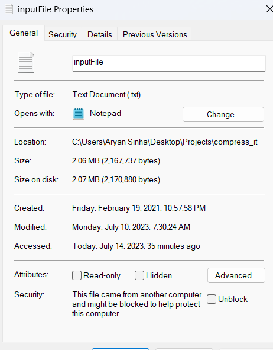
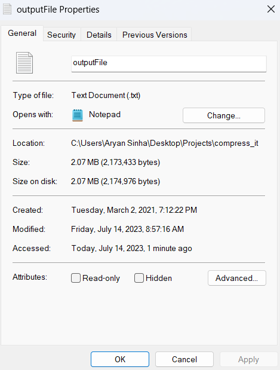
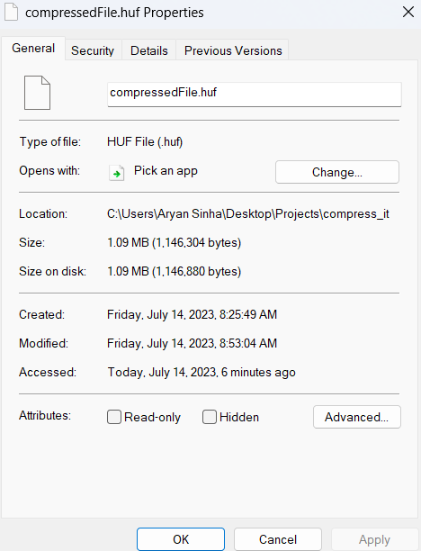


# Compress it

This project is based on Huffman Coding, a lossless, bottom-up compression algorithm. It can compress and decompress any text files.

To learn more about Huffman Coding and its applications in Information Theory read this article.

Implementation in Project
This project supports two functions:
1) Encode: Compresses input file passed.
2) Decode: Decompresses Huffman coded file passed back to its original file.

struct Node represents a node of Huffman Tree which is generated during compression or decompression of files. It stores character data, its frequency, Huffman code, and two pointers that point towards the left or right node if they exist.

Huffman class contains only two public functions
1) compress()
2) decompress()
And a constructor which accepts input file and output file. The object of this class can be initiated as follows: huffman h(inputFileName, outputFileName);

Compressing file compress(): Following are the steps followed to compress the input file.

1)createMinHeap(): This function reads the input file and stores the frequency of all the characters appearing in the file. It further creates a Min Heap structure based on the frequency of each character using priority queue as a data structure that stores Nodes and uses its frequency as a comparing parameter.

2)createTree(): This function generates the Huffman tree by duplicating the Min Heap created earlier keeping the original Min Heap. It pops the two Nodes with the lowest frequency. Further, it assigns these two as left and right nodes to a new Node with a frequency which is the sum of the two popped nodes and pushes this Node back to the Min Heap. This process is continued until Min Heap has a size equal to 1.

3)createCodes(): This function traverses the entire Huffman tree and assigns codes in binary format to every Node.

4)saveEncodedFile(): This function saves the Huffman encoded input file to the output file. The image below illustrates how the output file is written.

minHeap = ({character data} {huffman code for that character}) * minheapsize

{huffman code for that character} = 128 bits divided into 16 decimal numbers. Every number represents 8 bit binary number.
eg: {127 - code.length()} * '0' + '1' (representing start bit) + code = 128 bits
It is converted to 16 * 8-bit decimal numbers = 128 bits

{Encoded input File characters} {count0} = Entire file is converted into its huffman encoded form which is a binary code. This binary string is divided in 8-bit decimal numbers. If the final remaining bits are less than 8 bits, (8 - remainingBits) number of '0's are appended at the end. count0 is the number of '0's appended at the end.

The output file should be (.huf) file which represents it is a Huffman encoded file.

Decompressing file decompress(): Following are the steps followed to decompress the Huffman encoded file.

1)getTree(): This function reads the Min Heap stored at the beginning of the file and reconstructs the Huffman tree by appending one Node at a time. MinHeapSize is the first value, next {MinHeapSize * (1+16)} contains character data and 16 decimal values representing 128 bits of binary Huffman code. Ignore the initial (127 - code.length()) of '0's and starting '1' bit and append the Node.

2)saveDecodedFile(): This function reads the entire {Encoded input File charachters} and {count0} by ignoring the first {MinHeapSize * (1 + 16)} of the file. The decimal values are converted to their binary equivalent(huffman codes) and the resulting character is appended to the output file by traversing the reconstructed huffman tree. The final count0 number of '0's are ignored since they were extra bits added while saving the encoded file.

How to run this project?
To run this project you need to create an executable file. You can follow the steps given below:
1) For compressing:

2) For Decompressing:

Result: This project is just an implementation of Huffman coding, it is not as efficient as the compression algorithm used currently to compress files.
Example: inputFile.txt (2.2MB) is compressed to compressedFile.huf (1.1MB) file and decompressed back to ouputFile.txt (2.2MB).

